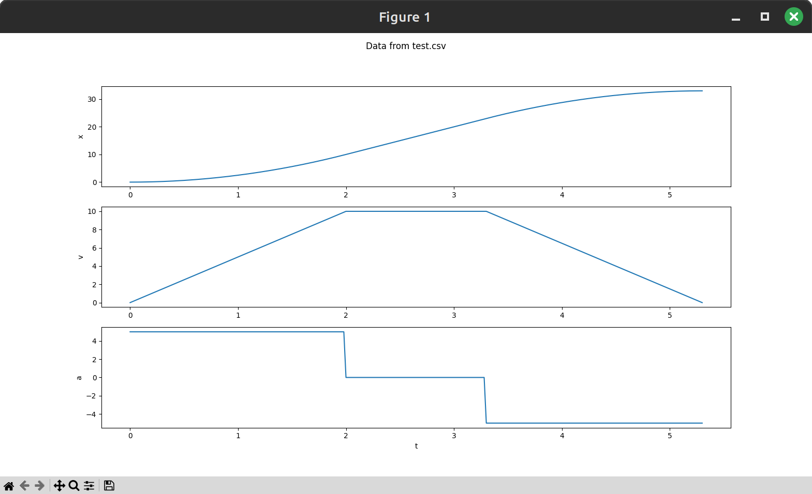

# Profile Plotter

## Usage

1. Install [`uv`](https://docs.astral.sh/uv/getting-started/installation/).
2. Run `uv sync` to install `matplotlib`
3. Run `uv run python <filename.csv>`

## Example

`uv run python profile.py test.csv` should yield :
